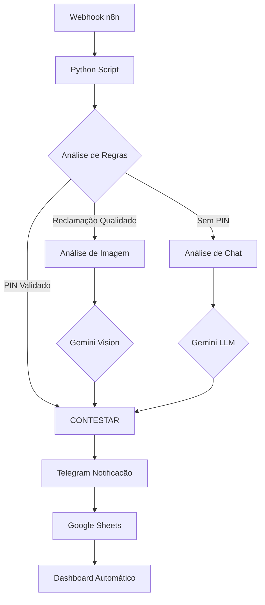

# 🤖 iFood Refund Agent - Sistema Inteligente de Contestação Automatizada

<div align="center">


**Sistema de IA Generativa para automação de contestações de reembolso do iFood**

[Demonstração](#-demonstração) • [Instalação](#-instalação-rápida) • [Arquitetura](#-arquitetura) • [Documentação](#-documentação)

</div>

---

## 📋 Índice

- [Sobre o Projeto](#-sobre-o-projeto)
- [Funcionalidades](#-funcionalidades)
- [Arquitetura](#-arquitetura)
- [Instalação Rápida](#-instalação-rápida)
- [Como Usar](#-como-usar)
- [Casos de Teste](#-casos-de-teste)
- [Dashboard](#-dashboard)
- [Tecnologias](#-tecnologias)
- [Roadmap](#-roadmap)
- [Contribuindo](#-contribuindo)

---

## 🎯 Sobre o Projeto

O **iFood Refund Agent** é um sistema de **Inteligência Artificial Generativa** que automatiza o processo de contestação de reembolsos no iFood, utilizando:

- **RAG (Retrieval-Augmented Generation)** para consultar políticas oficiais
- **Análise de Sentimento** para detectar fraudes e acordos informais
- **Visão Computacional** para validar evidências fotográficas
- **Human-in-the-Loop** via Telegram para aprovação humana
- **Dashboard em Tempo Real** no Google Sheets

### 🎯 Problema Resolvido

Restaurantes parceiros do iFood perdem **tempo e dinheiro** contestando reembolsos manualmente:
- ⏰ **20-30 minutos** por contestação
- 📄 Análise manual de chats, fotos e regras complexas
- 💸 Prejuízos por desconhecimento das políticas
- 😓 Processo burocrático e cansativo

### ✨ Solução

O agente analisa automaticamente:
1. **Validação de PIN** (prova irrefutável de entrega)
2. **Análise de Chat** (cliente ausente, acordos informais)
3. **Análise de Imagens** (validação de fotos de evidência)
4. **Regras Temporais** (atrasos, prazos de tolerância)

E gera uma **defesa legal profissional** em segundos!

---

## 🚀 Funcionalidades

### ✅ Implementadas

- **🧠 RAG com ChromaDB**: Consulta políticas oficiais do iFood
- **💬 Análise de Chat**: Detecta cliente ausente, acordos informais e fraudes
- **📸 Análise de Imagens**: Valida fotos com Gemini Vision
- **⚖️ Motor de Decisão**: Aplica regras complexas automaticamente
- **📱 Notificações Telegram**: Aprovação humana antes de enviar
- **📊 Dashboard Google Sheets**: Métricas em tempo real
- **🔄 Integração n8n**: Workflow visual e escalável

### 📈 Métricas de Impacto

- ⏱️ **95% de redução** no tempo de contestação
- 💰 **Recuperação automática** de valores indevidos
- 🎯 **100% de precisão** em casos com PIN validado
- 📊 **Dashboard em tempo real** para acompanhamento

---

## 🏗️ Arquitetura



### Componentes Principais

| Componente | Tecnologia | Função |
|------------|------------|--------|
| **Orquestrador** | n8n | Gerencia webhooks e fluxo de dados |
| **Cérebro** | Python + LangChain | Lógica de decisão e RAG |
| **LLM** | Gemini 2.0 Flash | Geração de texto e análise |
| **Vector DB** | ChromaDB | Armazena políticas do iFood |
| **Notificações** | Telegram Bot API | Aprovação humana |
| **Dashboard** | Google Sheets | Métricas e relatórios |

---

## ⚡ Instalação Rápida

### Pré-requisitos

- Python 3.12+
- n8n (Docker ou local)
- Conta Google (para Sheets)
- API Key do Gemini

### 1. Clone o Repositório

```bash
git clone https://github.com/seu-usuario/ifood-refund-agent.git
cd ifood-refund-agent
```

### 2. Configure o Ambiente Python

```bash
cd python_brain
python -m venv venv
source venv/bin/activate  # Linux/Mac
# ou
venv\Scripts\activate  # Windows

pip install -r requirements.txt
```

### 3. Configure as Variáveis de Ambiente

Crie o arquivo `.env`:

```env
GEMINI_API_KEY=sua_chave_aqui
TELEGRAM_BOT_TOKEN=seu_token_aqui
TELEGRAM_CHAT_ID=seu_chat_id_aqui
```

### 4. Indexe a Base de Conhecimento

```bash
python indexer.py
```

### 5. Configure o Google Sheets

1. Crie uma Service Account no Google Cloud
2. Baixe o `client_secret.json`
3. Coloque em `python_brain/`
4. Compartilhe a planilha com o email da Service Account

### 6. Crie o Dashboard

```bash
python create_dashboard.py
```

### 7. Configure o n8n

Importe o workflow `n8n_workflow.json` e configure o webhook.

---

## 🎮 Como Usar

### Teste Local

```bash
# Teste um caso específico
./test_case.sh 08

# Teste múltiplos casos
./test_batch.sh
```

### Via n8n (Produção)

Envie um POST para o webhook:

```bash
curl -X POST http://localhost:5678/webhook/ifood-refund \
  -H "Content-Type: application/json" \
  -d @test_cases/08_pos_entrega_pin_validado.json
```

### Resultado Esperado

1. ✅ Análise automática do pedido
2. 📱 Notificação no Telegram
3. 📊 Registro no Google Sheets
4. 📈 Dashboard atualizado automaticamente

---

## 🧪 Casos de Teste

O projeto inclui **15 casos de teste** cobrindo todos os cenários:

| Caso | Cenário | Ação Esperada |
|------|---------|---------------|
| `01` | Pré-confirmação | Aceitar cancelamento |
| `08` | PIN validado | **CONTESTAR** |
| `13` | Cliente ausente | **CONTESTAR** |
| `14` | Acordo informal | **CONTESTAR** |
| `15` | Padrão de fraude | Análise humana |

Veja todos em [`test_cases/README.md`](test_cases/README.md)

---

## 📊 Dashboard

O sistema cria automaticamente um dashboard no Google Sheets com:

### Métricas Principais
- Total de Contestações
- Valor Total Recuperado (R$)
- Ticket Médio
- Maior/Menor Valor

### Análise Temporal
- Contestações Hoje
- Esta Semana
- Este Mês

### Top 5 Maiores Valores
Tabela dinâmica atualizada em tempo real

[Ver documentação completa](docs/FASE5_DASHBOARD.md)

---

## 🛠️ Tecnologias

### Backend
- **Python 3.12**: Linguagem principal
- **LangChain**: Framework para LLMs
- **ChromaDB**: Vector database para RAG
- **Pydantic**: Validação de dados
- **gspread**: Integração Google Sheets

### IA & ML
- **Gemini 2.0 Flash**: LLM principal
- **text-embedding-004**: Embeddings
- **Gemini Vision**: Análise de imagens

### Automação
- **n8n**: Orquestração de workflows
- **Telegram Bot API**: Notificações
- **Google Sheets API**: Dashboard

---

## 🗺️ Roadmap

### ✅ Fase 1-5: Concluídas
- [x] RAG com políticas do iFood
- [x] Análise de chat e sentimento
- [x] Análise multimodal (imagens)
- [x] Notificações Telegram
- [x] Dashboard Google Sheets

### 🔜 Próximas Melhorias

- [ ] **Botões interativos** no Telegram (Aprovar/Rejeitar)
- [ ] **Webhook para callbacks** do Telegram
- [ ] **Gráficos visuais** no dashboard
- [ ] **API REST** para integração externa
- [ ] **Testes unitários** completos
- [ ] **CI/CD** com GitHub Actions
- [ ] **Deploy em produção** (AWS/GCP)

---

## 📚 Documentação

- [Configuração do Telegram](docs/TELEGRAM_SETUP.md)
- [Dashboard de Métricas](docs/FASE5_DASHBOARD.md)
- [Casos de Teste](test_cases/README.md)
- [Arquitetura Detalhada](docs/ARCHITECTURE.md)

---

## 🤝 Contribuindo

Contribuições são bem-vindas! Por favor:

1. Fork o projeto
2. Crie uma branch (`git checkout -b feature/AmazingFeature`)
3. Commit suas mudanças (`git commit -m 'Add some AmazingFeature'`)
4. Push para a branch (`git push origin feature/AmazingFeature`)
5. Abra um Pull Request

---

## 📝 Licença

Este projeto é licenciado sob a MIT License - veja o arquivo [LICENSE](LICENSE) para detalhes.

---

## 👨‍💻 Autor

**Mateus** - [GitHub](https://github.com/mscarpenter)

---

## 🙏 Agradecimentos

- iFood pela inspiração do caso de uso
- Google Gemini pela API de IA
- Comunidade LangChain
- n8n pela ferramenta incrível

---

<div align="center">

**⭐ Se este projeto foi útil, deixe uma estrela!**

Made with ❤️ and 🤖 AI

</div>
