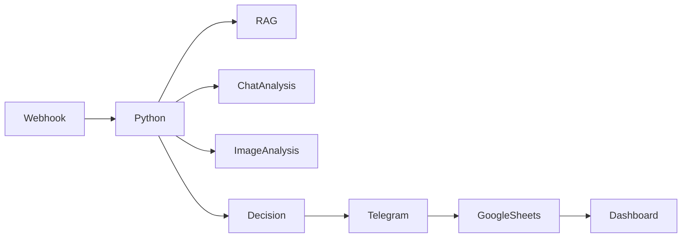

# 🏗️ Arquitetura Detalhada do iFood Refund Agent

## Visão Geral

O **iFood Refund Agent** é um sistema **end‑to‑end** que automatiza a contestação de reembolsos do iFood usando:
- **IA Generativa** (Gemini 2.0 Flash) para geração de texto e análise de imagens;
- **RAG** (Retrieval‑Augmented Generation) com **ChromaDB** para consultar a base de políticas do iFood;
- **Análise de Sentimento** e detecção de padrões de fraude em chats;
- **Human‑in‑the‑Loop** via **Telegram Bot** para aprovação humana;
- **Dashboard** em **Google Sheets** para métricas em tempo real;
- **Orquestração** com **n8n**.

A seguir está o detalhamento de cada camada e como elas se conectam.

---

## 1️⃣ Camada de Entrada – Webhook (n8n)

| Componente | Tecnologia | Função |
|------------|------------|--------|
| **Webhook n8n** | n8n (Docker) | Recebe requisições HTTP (`POST /webhook/ifood-refund`) contendo o JSON do pedido. |
| **Trigger** | n8n | Valida o payload, converte para o formato esperado e invoca o script Python. |

> **Observação:** O webhook pode ser configurado para receber chamadas de sistemas simulados ou de produção.

---

## 2️⃣ Camada de Processamento – `reimbursement_brain.py`

```mermaid
flowchart TD
    A[Webhook (n8n)] --> B[Python Script (reimbursement_brain.py)]
    B --> C{Motor de Decisão}
    C -->|PIN Validado| D[CONTESTAR]
    C -->|Sem PIN| E[Análise de Chat]
    C -->|Qualidade| F[Análise de Imagem]
    D --> G[Gerar Defesa]
    E --> H[Gemini LLM (Chat Analysis)]
    F --> I[Gemini Vision]
    G --> J[Telegram Notificação]
    J --> K[Google Sheets Log]
    K --> L[Dashboard (Google Sheets)]
```

### Principais módulos internos

| Módulo | Responsabilidade |
|--------|-----------------|
| `load_order_data` | Carrega o JSON de entrada e valida com **Pydantic** (`OrderData`). |
| `process_refund_request` | Motor de decisão que aplica as regras de negócio (PIN, atraso, qualidade, etc.). |
| `analyze_chat_context` | Analisa o histórico de chat (ausência, acordos informais, sentimento, padrões de fraude). |
| `analyze_image_evidence` | Usa **Gemini Vision** para validar fotos de evidência (autenticidade, consistência). |
| `rag_chain` | **Retrieval‑Augmented Generation**: consulta a base de políticas armazenada em **ChromaDB**. |
| `send_telegram_approval` | Envia mensagem formatada ao bot do Telegram para aprovação humana (botões opcionais futuramente). |
| `log_roi_to_sheet` | Grava o resultado no Google Sheet “Relatório_ROI_iFood”. |

---

## 3️⃣ Camada de Conhecimento – RAG com ChromaDB

```mermaid
flowchart LR
    subgraph KnowledgeBase[Base de Conhecimento]
        direction TB
        P[Políticas iFood (PDF/MD)]
    end
    subgraph VectorStore[ChromaDB]
        direction TB
        V[Embeddings (text‑embedding‑004)]
    end
    P -->|Indexação| V
```

- **Documentos indexados**: PDFs, markdowns e textos de políticas de reembolso do iFood.  
- **Embeddings**: `text-embedding-004` (Gemini).  
- **Busca**: `RetrievalQA` do LangChain que devolve o trecho mais relevante para a *query* gerada pelo motor de decisão.

---

## 4️⃣ Camada de IA – Gemini 2.0 Flash

| Uso | Prompt (resumido) | Saída |
|-----|-------------------|-------|
| **RAG** | "Qual a regra para entrega atrasada > 10 min?" + contexto do pedido | Texto da política oficial (markdown). |
| **Chat Analysis** | Histórico de mensagens + metadados do pedido | JSON estruturado (`has_chat`, `customer_absent`, `informal_agreement`, `sentiment`, `red_flags`). |
| **Image Analysis** | URL ou base64 da foto + descrição do caso | JSON com `verdict`, `confidence`, `reasoning`, `red_flags`. |

> **Formato de retorno**: Sempre JSON encapsulado em markdown code‑block (` ```json ... ``` `) para facilitar o parsing.

---

## 5️⃣ Camada de Aprovação Humana – Telegram Bot

```mermaid
flowchart TD
    G[Gerar Defesa] --> H[Telegram Bot]
    H --> I[Mensagem ao Parceiro]
    I --> J{Aprovar?}
    J -->|Sim| K[Enviar para iFood (simulado)]
    J -->|Não| L[Marcar para revisão]
```

- **Função `send_telegram_approval`**:
  - Formata a mensagem com emojis, detalhes da contestação e a defesa gerada.
  - Envia via API `sendMessage`.
  - (Futuro) Botões inline **Aprovar** / **Rejeitar** com webhook de callback.
- **Credenciais**: `TELEGRAM_BOT_TOKEN` e `TELEGRAM_CHAT_ID` armazenados no `.env`.

---

## 6️⃣ Camada de Persistência & Métricas – Google Sheets

| Aba | Propósito |
|-----|-----------|
| `Relatório_ROI_iFood` | Log linha‑a‑linha de cada contestação (order_id, financial_impact, defense). |
| `Dashboard` | Métricas agregadas (total, valor recuperado, ticket médio, top‑5, análise temporal). |

### Fórmulas principais (exemplo)
```excel
=COUNTA(Relatório_ROI_iFood!A:A)-1          // Total de contestações
=SUM(Relatório_ROI_iFood!B:B)               // Valor total recuperado
=AVERAGE(Relatório_ROI_iFood!B:B)           // Ticket médio
=QUERY(Relatório_ROI_iFood!A:C,"SELECT A,B,C ORDER BY B DESC LIMIT 5",1) // Top 5
```

O dashboard atualiza **automaticamente** sempre que uma nova linha é inserida.

---

## 7️⃣ Orquestração – n8n Workflow



- **Passos do workflow**:
  1. Recebe JSON do pedido.
  2. Executa `reimbursement_brain.py`.
  3. Captura saída JSON (stdout).
  4. Se `action == "CONTESTAR"` envia notificação Telegram.
  5. Sempre grava resultado em `Relatório_ROI_iFood`.
  6. Dashboard reflete as métricas em tempo real.

---

## 8️⃣ Tecnologias Utilizadas

| Camada | Tecnologia |
|--------|------------|
| Orquestração | **n8n** (Docker) |
| Backend | **Python 3.12**, **LangChain**, **Pydantic** |
| IA LLM | **Gemini 2.0 Flash** (Google) |
| Embeddings | **text‑embedding‑004** (Gemini) |
| Vector Store | **ChromaDB** |
| Vision | **Gemini Vision** |
| Mensageria | **Telegram Bot API** |
| Persistência | **Google Sheets API** (`gspread`) |
| Dashboard | **Google Sheets** (fórmulas) |
| CI (opcional) | **GitHub Actions** |

---

## 9️⃣ Segurança & Privacidade

- **Credenciais** armazenadas em `.env` e nunca versionadas.
- **Token do Telegram** e **Google Service Account** têm permissões mínimas.
- **Dados sensíveis** (ex.: fotos de pedidos) são processados apenas em memória; não são armazenados.
- **Logs** são enviados para `stderr` (para n8n) e não contêm informações pessoais.

---

## 🔧 Como Executar Localmente

```bash
# 1. Clonar o repositório
git clone https://github.com/mscarpenter/ifood-refund-agent.git
cd ifood-refund-agent

# 2. Criar e ativar venv
python -m venv venv
source venv/bin/activate   # Linux/macOS
# venv\Scripts\activate   # Windows

# 3. Instalar dependências
pip install -r python_brain/requirements.txt

# 4. Configurar .env (exemplo abaixo)
cat > python_brain/.env <<EOF
GEMINI_API_KEY=YOUR_GEMINI_KEY
TELEGRAM_BOT_TOKEN=YOUR_TELEGRAM_BOT_TOKEN
TELEGRAM_CHAT_ID=YOUR_CHAT_ID
GOOGLE_API_KEY=YOUR_GOOGLE_SHEETS_KEY
EOF

# 5. Indexar a base de conhecimento (executa apenas uma vez)
python python_brain/indexer.py

# 6. Criar o dashboard (ou usar o já criado)
python python_brain/create_dashboard.py

# 7. Testar um caso
./test_case.sh 08
```

---

## 📦 Estrutura de Diretórios

```
ifood-refund-agent/
├── README.md                     # Documentação principal
├── LICENSE                       # MIT License
├── CONTRIBUTING.md               # Guia de contribuição
├── docs/
│   ├── ARCHITECTURE.md          # <--- ESTE ARQUIVO
│   ├── TELEGRAM_SETUP.md        # Configuração do bot Telegram
│   ├── FASE5_DASHBOARD.md       # Documentação do dashboard
│   └── VIDEO_SCRIPT.md          # Roteiro do vídeo de demonstração
├── python_brain/
│   ├── reimbursement_brain.py   # Motor principal
│   ├── indexer.py               # Indexador RAG
│   ├── create_dashboard.py      # Cria aba Dashboard
│   ├── get_telegram_chat_id.py  # Helper para obter CHAT_ID
│   ├── requirements.txt         # Dependências Python
│   └── .env                     # Variáveis de ambiente (não versionado)
├── test_cases/
│   ├── 01_pre_confirmacao.json
│   ├── 08_pos_entrega_pin_validado.json
│   ├── 13_chat_customer_absent.json
│   └── ... (total 15 casos)
├── test_images/                  # Imagens de evidência para testes
├── n8n_workflow.json            # Export do workflow n8n
└── scripts/
    ├── test_case.sh            # Executa caso único
    └── test_batch.sh           # Executa múltiplos casos
```

---

## 🚀 Próximos Passos (Roadmap)

- **Botões interativos** no Telegram (Aprovar / Rejeitar) com webhook de callback.
- **Gráficos avançados** no dashboard (pie, line).
- **API REST** para integração externa.
- **Deploy em nuvem** (GCP Cloud Run ou AWS Lambda).
- **Testes unitários** e **CI/CD** automatizados.

---

## 📞 Contato

**Mateus** – Desenvolvedor principal
- GitHub: [mscarpenter](https://github.com/mscarpenter)
- LinkedIn: [Mateus Carpenter](https://linkedin.com/in/mscarpenter)
- Email: mateus@example.com

---

<div align="center">

**🎉 Projeto concluído com sucesso!**

Made with ❤️ and 🤖 AI

</div>
